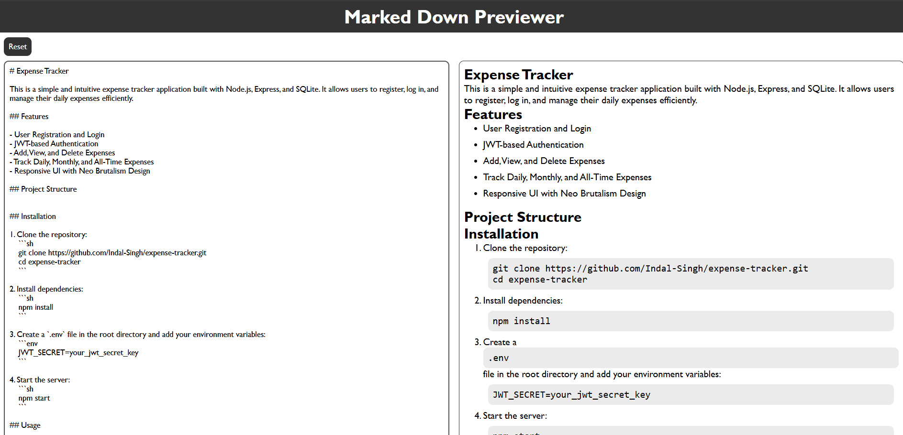

# MarkeDown Preview

## Description
MarkeDown Preview is a web application that allows users to preview their Markdown files in real-time. It provides a user-friendly interface to edit and view Markdown content simultaneously.

## Installation
To install and run the application locally, follow these steps:

1. Clone the repository:
    ```sh
    git clone https://github.com/Indal-Singh/markedDown_preview_website.git
    ```
2. Navigate to the project directory:
    ```sh
    cd markedDown_preview_website
    ```

## Features
- Real-time Markdown preview
- Syntax highlighting
- User-friendly interface

## Screenshots
Here are some screenshots of the application:



## Deployment
You can access the deployed application at the following link:
[MarkeDown Preview Deployment](https://indal-singh.github.io/markedDown_preview_website/)


